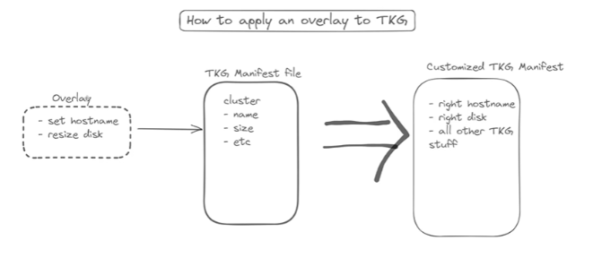

## Deploy Tanzu Kubernetes Grid into AWS Commercial Cloud Services (C2S)

## AWS Commercial Cloud Services (C2S)
The AWS Secret Region is readily available to the U.S. Intelligence Community (IC) through the IC’s Commercial Cloud Services (C2S) contract with AWS and is available to the DoD on the [AWS GSA IT70](https://aws.amazon.com/contract-center/federal-contracts/) schedule.

## C2S considerations 

Before deploying VMware Tanzu Kubernetes Grid in an AWS Commercial Cloud Services (C2S) environment, consider the following points .

* The C2S office should run the CloudFormation script to make the IAM roles.
* S3 buckets should be encrypted beyond simple server-side due to C2S policy. You should check with your local security organization for encryption policies.
* You will need to set up a local Harbor registry.
* In C2S you will have direct access to AWS APIs with no need for AWS service endpoints.
* C2S does not support **gp3** volumes.You will need to configure [Packer build](https://www.packer.io/) accordingly.
* You will need to configure Packer to use the C2S CA instead of the public AWS one.
* Even with an existing AMI, you must pass in ami_filter parameters to Packer (i.e. `ami_filter_name` and `ami_filter_owner`)
* Set the network MTU(maximum transmission unit) on your kubernetes images to 8801. 

## Packages and Software to Transfer

The following packages and software will need to be transferred into the C2S environment.

* Tanzu Kubernetes Grid bits.
* [kind](https://kind.sigs.k8s.io/) - The kind CLI is included in the Tanzu CLI. But you will need the kind CLI in order to clean potential failed management cluster deployments. Refer to [clean up after an unsuccessful management cluster deployment](https://docs.vmware.com/en/VMware-Tanzu-Kubernetes-Grid/1.5/vmware-tanzu-kubernetes-grid-15/GUID-troubleshooting-tkg-tips.html#clean-up-after-an-unsuccessful-management-cluster-deployment-0) for more information. 

* crashd - This is a utility available on [VMware's customer connect portal](https://customerconnect.vmware.com/) and is used for fetching diagnostic details from a KIND cluster in the event of a failed bootstrap.

## Tanzu Kubernetes Grid AWS Services for C2S

The following recommendations/steps should be considered for consuming various AWS services for Tanzu Kubernetes Grid installations in C2S.

### AWS GovCloud Regions/Partitions

The [CloudFormation template](https://aws.amazon.com/cloudformation/resources/templates/) makes use of [Amazon Resource Name (ARN)](https://docs.aws.amazon.com/general/latest/gr/aws-arns-and-namespaces.html) IDs. The region in those ARNs is `aws`. This causes failure in C2S since the proper region in C2S is `aws-iso`. This change must be made in the CloudFormation template and is the only edit necessary before running it.


### IAM Roles

* You should check your agency/departmental IAM policy.There will likely be a set process in place for creating and updating IAM objects.

* Some agencies/department require prefixing user-created roles with ‘cr-’ (roles) or ‘cp-’ (policies). This can break the  CloudFormation script that VMware supports.

* Some agencies/departments abstract away IAM entirely and provide only the option to adapt a policy from existing  agency/department policies, or require that you submit a ticket to have a new policy created. 

* You should try deploying the CloudFormation script as-is. If it fails,you should ask your local C2S office to deploy the CloudFormation script into your account for you (<b>as-is script</b>).Any modifications in CloudFormation script can break Tanzu Kubernetes Grid functionality since ClusterAPI will be looking for exact role names in IAM.


### AWS Service Endpoints

The following AWS API endpoints must be available:

* S3
* elasticloadbalancing
* ssm
* ssmmessages
* ec2
* ec2messages
* cloudformation
* sts
* secretsmanager

Access to AWS API endpoints can vary.At some agencies/departments , you may need to request a firewall exception for the `IP CIDR` in your VPC OR use [VPC endpoints](https://docs.aws.amazon.com/vpc/latest/privatelink/concepts.html). And in some agencies/departments you might have direct access to AWS API endpoints. You should check with your AWS contact for these details.

### Tanzu Kubernetes Grid Node Image Creation
In a C2S environment you, the organization installing Tanzu Kubernetes Grid,should have an image creation process and it should run in your secured environment (high side). Options for base images are:
- Amazon Linux 2(AL2)
- Ubuntu

As part of the image-build process, Kubernetes components can be installed in two ways:
- OS packages
- Binary tarballs

For either of the above packaging options you will need
- Package repository (i.e. apt repository or yum repository)
- Kubernetes components (in the form of tarballs or OS-specific packages)

**Notes:** 
- Amazon provides a package repository for Amazon Linux 2(AL2).
- You will need an http(s) endpoint to host binary tarballs.
- For OS packages you will need to host a repository and transfer OS packages on it. 


### MTU(maximum transmission unit) Configuration on Node Images

The default value for Tanzu Kubernetes Grid /image-builder is **9001** but C2S sets the network/gateway MTU to **8801**.In C2S set the network MTU(maximum transmission unit) on your kubernetes images to 8801. 

**Notes:**
#### Known Issues:
- Result of a request from Antrea combined with the no fragment would be that packets will be fragmented if they hit the wire between k8s nodes. When components are spread across multiple VMs, this means fragmented packets are sent from (for example) the API server to a webhook, causing the webhook to simply return an HTTP 400 because it got a mangled request (because Antrea uses the no fragment flag and simply drops the fragmented packets).

- Be aware of your network gateway’s MTU. Set your node images to have an MTU of no more than the network’s MTU (in the case of C2S it should be 8801). Refer to [MTU variations across instance types](https://docs.aws.amazon.com/AWSEC2/latest/UserGuide/network_mtu.html) for more information.


## Troubleshooting  

This section  discusses troubleshooting and solutions for common problems you may face.

* Various fixes take the form of an overlay. Anytime you need to apply an overlay, it should be placed in the host machine/terminal directory`~/.config/tanzu/tkg/providers/ytt/<overlay yaml file>`. Overlay files placed in this directory are applied to all Tanzu Kubernetes Grid clusters created.

Simple overlay flow on Tanzu Kubernetes Grid

 

* **Example**: Configuring capa-controller-manager to use custom CA’s. To configure bootstrapper to use C2S CA , add in file  `~/.config/tanzu/tkg/providers/infrastructure-aws/{VERSION_NUMBER}/infrastructure-components.yaml`

Step 1 - Look for (in the `capa-system` namespace):
```
kind: Deployment
metadata:
  labels:
    cluster.x-k8s.io/provider: infrastructure-aws
    control-plane: capa-controller-manager
  name: capa-controller-manager
```
Step 2 - Under `volumeMounts` for the `manager` container add
```
- mountPath: /etc/ssl/certs
   name: c2s-root-certificate
   readOnly: true
```
Step 3 - Under `volumes` add 

```
- name: c2s-root-certificate
   secret:
     defaultMode: 420
     secretName: c2s-root-certificate

```

Step 4 - And add this to the bottom of the file

```
---
apiVersion: v1
data:
  c2s.crt: B64ENCODED_ROOT_CERTIFICATE_CHANGEME
kind: Secret
metadata:
  labels:
    cluster.x-k8s.io/provider: infrastructure-aws
  name: c2s-root-certificate
  namespace: capa-system
type: Opaque

```

Step 5 -  Change **B64ENCODED_ROOT_CERTIFICATE_CHANGEME** in step 4 above to a base64 encoded string of the contents of the desired root certificate file.

## Frequently Asked Questions(FAQ's)

### Questions to ask your PMO

A successful deployment of Tanzu Kubernetes Grid will require the creation of Virtual Private Clouds (VPCs), subnets, Elastic Load Balancers (ELBs), and other AWS objects. The methods for the creation and management of these resources varies from one agency’s PMO to another.

To help you understand what is available and to plan your deployment, here is a list of questions to ask your PMO.

* **Where will my VPC live?**

     VPC could be in Joint Worldwide Intelligence Communications System (JWICS) at large Or it can be in agency network. Answer can depend on who are the users and what is your intended mission (i.e. all of users from agency or people from outside of agency as well).

* **How do I connect to AWS endpoints?**

    Sometimes this “just works” and nothing needs to be done. Sometimes this requires a firewall exception be made for user's VPC. Sometimes you need to make Service Endpoints. Ask the PMO what you need in order to connect to the AWS endpoints.

* **What AWS services are self-service, and which require help tickets?**

  The answers to these questions will help you plan. What can you work out later, and what do you need to plan now? That way, you can submit help desk tickets ASAP to minimize time delays. Some AWS resources that we have seen locked behind help desk tickets include:
    - VPC creation
    - Subnet creation/management
    - Route table creation/management
    - IAM resource creation/management (i.e. Roles and Policies)

* **Can I use private networking in my VPC?**

    Commercial AWS defaults to using private networking in VPC’s. That is, you can have a VPC with a CIDR of 10.0.0.0/16 (for example). Some agencies do not support this and require that all IPs in a VPC are ‘public’ agency IPs. This will impact your IP space because now IPs are a finite commodity.

* **Are there any limitations to the self-service resources?**

    Some PMO policy may require that (for example) IAM role and policy names be prefixed with ‘cr-’ and ‘cp-’. Failing to do this returns a vague permissions error. Simple fix is to implement the prefix. 

* **Does your PMO have any limitations like this for any resources that allow self-service?**

* **How does DNS in my VPC behave? Are there limitations?**

    - Commercial AWS uses the second IP of your VPC CIDR as the DNS server.This could be true in C2S but the DNS may be limited. For example DNS provided for lookups JWICS resources was not in agency network. 
    In order for Tanzu Kubernetes Grid bootstrapping to succeed, your ec2 instances in your VPC must be able to communicate to each other over DNS by their AWS name (i.e. ip-10-0-0-50.compute.internal). If this functionality is not there, the bootstrapping will fail.

    - Know the nuances of DNS in your VPC, how to perform DNS lookups into your host agency, and into Joint Worldwide Intelligence Communications System (JWICS).

* **How does an ELB behave? Where does it terminate?**

     Commercial AWS sees traffic inside the VPC as `internal` and everything else as `public`. This may not be the case for your VPC. For example, at one agency, we needed to annotate Kubernetes services as `internal` in order for the ELB to terminate into the agency network because the entire agency is seen as `internal` and Joint Worldwide Intelligence Communications System (JWICS) is seen as `external`. 
