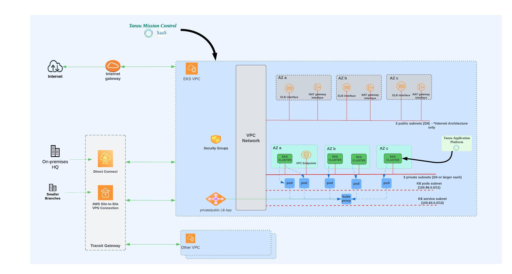
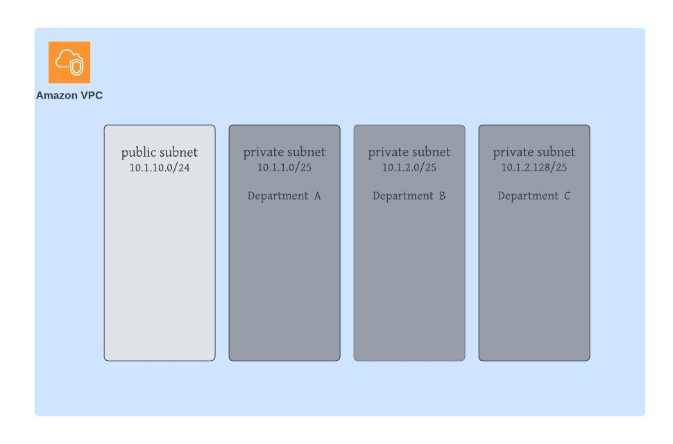
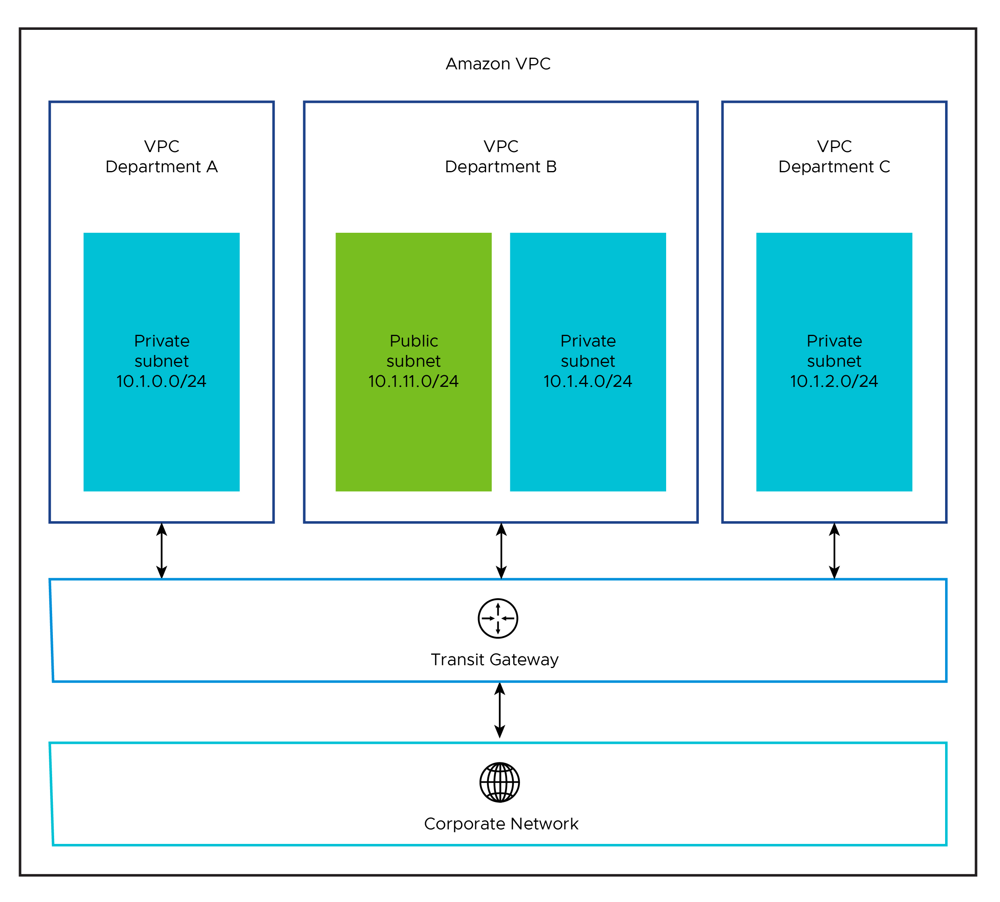

## Amazon Networking and Virtual Private Cloud(VPC)

For Tanzu services like Tanzu Mission Control-SaaS(TMC),Tanzu Application Platform(TAP),Tanzu Service Mesh-SaaS(TSM) etc on Amazon EKS you can refer following network,VPC design recommendations.

### Network Overview
The following network diagram shows the network layout for a single virtual private cloud (VPC). The network layout uses the following types of subnets:

* One private subnet for each Amazon availability zone (AZ). These subnets are not automatically allocated a public IP address. The default gateway is a NAT gateway.  
* One public subnet for each Amazon availability zone (AZ). These subnets are automatically allocated a public IP address. The default gateway is an Internet gateway if the subnet is connected to the Internet. A public subnet is optional if you do not need Internet ingress or egress.



### Network Recommendations

To control the multiple Amazon EKS clusters lifecycle operations like create , update , delete, manage etc from Tanzu mission control ,Consider the following when configuring the network for Amazon EKS.

* Create an Amazon Transit Gateway for a network architecture with multiple VPCs with multiple Availability Zones. The Amazon Transit Gateway connects all your VPCs and on-premises networks through a central hub. This simplifies your network and avoids complex peering relationships. The Amazon Transit Gateway acts as a cloud router – each new connection is made only once.
* Enable the `auto-assign-ip-on-launch` flag set on the public subnet before creating the Amazon EKS cluster from Tanzu Mission Control.
* Enable egress in VPC for Tanzu Mission Control SaaS to communicate with its agent installed on Amazon EKS clusters. 
* Enable egress and ingress capabilitis from vpc for Tanzu Application platform its external and cross cluster networking.
* Use an internal load balancer scheme. A best practice is to create an internal load balancer to avoid exposing the Kubernetes API to the public Internet. To avoid creating a public-facing load balancer, you can set `service.beta.kubernetes.io/aws -load-balancer-internal: "true”` . This setting customizes the EKS cluster’s load balancer to use an internal scheme, which means that its Kubernetes API server will not be accessible and routed over the Internet.
* Consider expanding your VPC network by adding additional CIDR ranges. This capability can be used if you are running out of IP ranges within your existing VPC or if you have consumed all available [RFC 1918](http://www.faqs.org/rfcs/rfc1918.html) CIDR ranges within your corporate network.Amazon EKS support additional secondary CIDR blocks. Refer to the [optimize ip addresses usage by pods in amazon EKS cluster](https://aws.amazon.com/blogs/containers/optimize-ip-addresses-usage-by-pods-in-your-amazon-eks-cluster) for more details.

### VPC Architectures

In a production deployment, you should provision EKS clusters in multiple Availability Zones (AZs).VMware recommends that you create the VPCs before you deploy Amazon EKS clusters. Also, make sure that you tag a private subnet in each AZ. As a best practice, ensure that the value you use for the private subnets for an AZ can easily identify the subnets as belonging to the same AZ. For example:

```
aws ec2 create-subnet --vpc-id $vpcId --cidr-block <ip_address> --availability-zone ${Amazon_REGION}b --tag-specifications ‘ResourceType=subnet, Tags=[{Key=Name,Value=priv-b}]’ --output json > $WORKING_DIR/subnet-priv-b
```

Based on your application needs and desired outcomes, you can organize your clusters by using one of the following VPC architectures.

#### Single VPC with Multiple Availability Zones

For most use cases, a single VPC spread across multiple AZs is sufficient. If more separation is needed within one VPC, more subnets can be used to provide better IP-based visibility to corporate firewalls. The network diagram above depicts this architecture (considering the each departments IP separations for better utilization of IP’s).



#### Multiple VPC with Multiple Availability Zones

For more separation of application workloads on Amazon, you can deploy separate EKS clusters to independent private VPCs. This separation might be desirable for workloads with different compliance requirements across different business units. 
The following diagram shows an example architecture with multiple VPCs. The load balancers in the example architecture are configured as internal load balancers.



Consider the following design implications when designing your network architecture.

 **Decision ID** | **Design Decision**  | **Design Justification**  | **Design Implications**
-----|-----|-----|-----
 NW-001 | Use separate networks for EKS clusters based on their usage | Isolate production EKS clusters from dev/test clusters | A separate set of Service Engines can be used for separating dev/test workload clusters from prod clusters
NW-002 | Use separate networks/VPCs for the each department  function EKS clusters | Better isolation and security policies between departments isolate EKS clusters from department functions | Sharing the same network for multiple clusters can cause shortage of IP addresses

To learn more about Amazon VPC , Refer to getting [started with amazon VPC](https://docs.aws.amazon.com/vpc/latest/userguide/vpc-getting-started.html) and [Amazon EKS VPC and subnet requirements and considerations](https://docs.aws.amazon.com/eks/latest/userguide/network_reqs.html).
