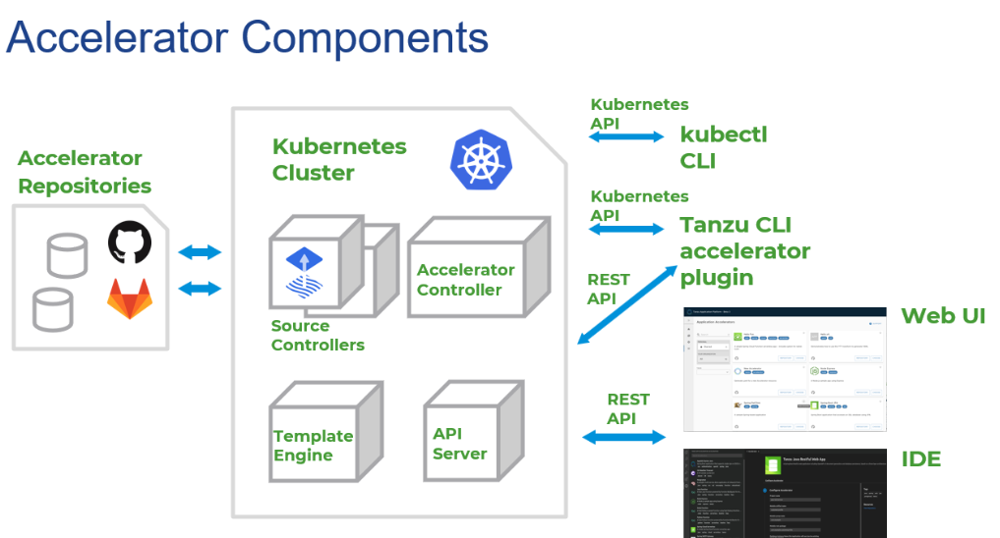
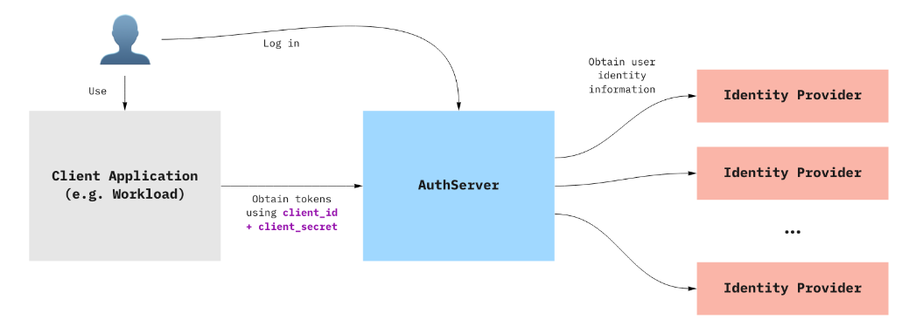
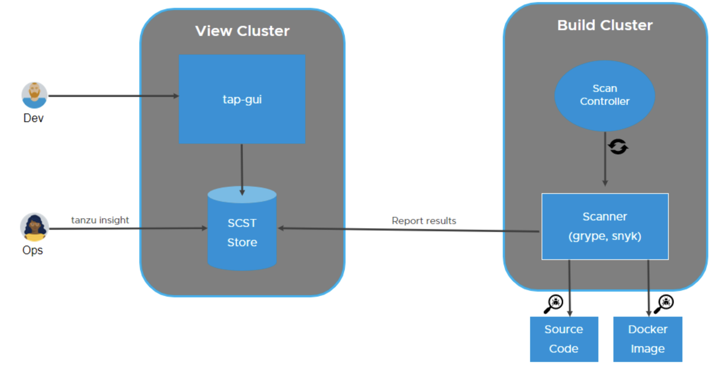

# VMware Tanzu Application Platform Developer Components

VMware Tanzu Application Platform (informally known as TAP) provides development tools which allow developers to quickly build, test, deploy, and manage applications lifecycle.

## Application Workloads

Tanzu Application Platform allows developers to quickly build and test applications. You can turn source code into a workload that runs in a container with a URL. A workload allows users to choose application specifications, such as repository location, environment variables, service binding, etc.

When using the Out of the Box Supply Chain, the `apps.tanzu.vmware.com/workload-type` annotation selects which style of deployment is suitable for your application. The valid values are:

| Workload Type   | Description  | Indicators
|---            |---                |---
web | Scalable Web Applications | - Scales based on request load <br> - Automatically exposed by means of HTTP Ingress <br> - Does not perform background work <br> - Works with Service Bindings <br> - Stateless
server | Traditional Applications | - Provides HTTP or TCP services on the network <br> - Exposed by means of external Ingress or LoadBalancer settings <br> - Might perform background work from a queue <br> - Works with Service Bindings <br> - Fixed scaling, no disk persistence
worker | Background Applications | - Does not provide network services <br> - Not exposed externally as a network service <br> - Might perform background work from a queue <br> - Works with Service Bindings <br> - Fixed scaling, no disk persistence

## List of Tanzu Application Platform Developer Components (Inner-Loop)

Tanzu Application Platform Dev components include, but are not limited to, the following:

* Accelerator
* API Portal
* AppSSO
* API Auto Registration
* AppLiveView
* Supply Chain Security Tools (SCST) - Scan

## Accelerator

The Application Accelerator user interface (UI) enables you to discover available accelerators, configure them, and generate new projects to download.

### Accelerator Architecture



Application Accelerator allows you to generate new projects from files in Git repositories. An `accelerator.yaml` file in the repository declares input options for the accelerator. Accelerator custom resources (CRs) control which repositories appear in the Application Accelerator UI. The Accelerator controller reconciles the CRs with a Flux2 Source Controller to fetch files from GitHub or GitLab.

See [Tanzu Application Platform Accelerator](https://docs.vmware.com/en/VMware-Tanzu-Application-Platform/1.6/tap/application-accelerator-about-application-accelerator.html) for more information.

## API Portal

API portal enables API consumers to find APIs they can use in their own applications. API portal assembles its dashboard and detailed API documentation views by ingesting OpenAPI documentation from the source URLs.

See [Tanzu Application Platform API portal](https://docs.vmware.com/en/VMware-Tanzu-Application-Platform/1.6/tap/api-portal-install-api-portal.html) for more information.

## AppSSO

The AppSSO conforms to the OIDC standard, and enables the use of external identity providers for user management, registration, and authentication. It supports OIDC providers such as Microsoft Active Directory, Okta, Google, Facebook, etc.

### AppSSO Architecture



The following components must be installed on the `run` cluster.

- **IdentityProvider** - these include social media providers, such as, Google, Facebook, or SAML providers, such as, Active Directory.
- **AuthServer** - the intermediary between the identity provider and the client application, where one or more identity providers are defined.
- **ClientRegistration** -  handles requests for the client id and client secret on behalf of an application, and defines the scopes allowable by the backend authentication server.
- **OAuth2 Proxy** - a sidecar container deployed with an application for handling inbound and outbound authentication traffic to the end-user application in the same pod.

See the following sample:

```
Kind: AuthServer
spec:
  replicas: 1
  tls:
    disabled: true
  identityProviders:
   - name: my-oidc-provider
      openID:
        issuerURI: https://auth-service.auth0.com
        clientID: my-client-abcdef
        clientSecretRef:
          name: my-openid-client-secret
        scopes:
          - "openid"
          - "other-scope"
        authorizationUri: https://example.com/oauth2/authorize
        tokenUri: https://example.com/oauth2/token
        jwksUri: https://example.com/oauth2/jwks
        claimMappings:
          roles: my-oidc-provider-groups

```

The values in the `identityProviders` section can be retrieved from the identity provider and set here. For example, the `issuerURI`, in this case, is `Auth0`. It supports OIDC providers such as Microsoft Active Directory, Okta, Google, Facebook, etc.

```
kind: ClientRegistration
spec:
   authServerSelector:
      matchLabels:
         name: my-first-auth-server
         env: tutorial
   redirectURIs:
      - "http://test-app.example.com/oauth2/callback"
   requireUserConsent: false
   clientAuthenticationMethod: basic
   authorizationGrantTypes:
      - "client_credentials"
      - "authorization_code"
   scopes:
      - name: "openid"
      - name: "email"
      - name: "profile"
      - name: "roles"
      - name: "message.read"

```

The settings in `ClientRegistration` contain the redirectUrl pointing to a page in the end-user application to be redirected to after successful authentication. The settings here also reference the AuthServer by its pod’s labels on behalf of the end-user application.

See [Tanzu Application Platform AppSSO](https://docs.vmware.com/en/VMware-Tanzu-Application-Platform/1.6/tap/app-sso-about.html) for more information.

## API Auto Registration

API Auto Registration automates the registration of API specifications defined in a workload’s configuration and makes them accessible in the Tanzu Application Platform GUI without additional steps. An automated workflow, using a supply chain, leverages API Auto Registration to create and manage a Kubernetes Custom Resource (CR) of kind [APIDescriptor](https://docs.vmware.com/en/VMware-Tanzu-Application-Platform/1.6/tap/api-auto-registration-key-concepts.html). It automatically generates and provides API specifications in OpenAPI, AsyncAPI, GraphQL, or gRPC API formats to the Tanzu Application GUI [API Documentation plugin](https://docs.vmware.com/en/VMware-Tanzu-Application-Platform/1.6/tap/tap-gui-plugins-api-docs.html).

### Tanzu Application Platform GUI Automated Workflow


The API Documentation plugin displays a list of APIs provided by components registered in the Catalog providing an easy way for developers to find APIs in a single location.

API Auto Registration components are installed by the `run` and `full` profiles.

### Recommendations

- The API Auto Registration package configuration in `run` clusters [must be updated](https://docs.vmware.com/en/VMware-Tanzu-Application-Platform/1.6/tap/api-auto-registration-usage.html#update-values) to include the Tanzu Application Platform GUI URL allowing it to register workload APIs into the GUI in the `view` cluster.
- Workload configuration files must set the `register-api` property to true to enable this feature and include the `api_descriptor` parameter. For example: `apis.apps.tanzu.vmware.com/register-api: "true"`. 
- To use the OpenAPI “TRY IT OUT” feature in Tanzu Application GUI, the Workload must configure Cross-origin Resource Sharing (CORS) to allow requests originating from the GUI.

To learn more about API Auto Registration, see [API Auto Registration](https://docs.vmware.com/en/VMware-Tanzu-Application-Platform/1.6/tap/api-auto-registration-about.html).

## AppLiveView

Application Live View is a lightweight insights and troubleshooting tool that helps app developers and app operators to look inside running applications. The application provides information from inside the running processes using its HTTP endpoints, otherwise known as actuators. Application Live View uses those endpoints to get and interact with metric data from your application.

### AppLiveView Cluster Architecture on Multi-Cluster Setup


The following packages are installed by default in a multi-cluster topology.

- **backend.appliveview.tanzu.vmware.com** should be included in the `view` cluster profile and exposed as a Kubernetes Service to connectors on the `run` cluster.
- **connector.appliveview.tanzu.vmware.com** should be included in the `run` cluster profile and deployed as a Kubernetes DaemonSet configured to communicate with the backend service on the `view` cluster.
- **conventions.appliveview.tanzu.vmware.com** should be included in the `build` profile and deploy the Conventions service.

The relevant profile settings only apply to:

#### View Cluster

```
profile: view
appliveview:
  ingressEnabled: true #optional, false by default
  ingressDomain: <domain> #optional, overrides shared ingress
  sslDisabled: true #optional, false by default
```

#### Run Clusters

```
profile: run
appliveview_connector:
  backend:
    sslDisabled: true #optional, false by default
    host: appliveview.${view_domain} #appliveview is default subdomain

```

### AppLiveView Dependencies

Application workloads require actuator endpoints to report metrics from within the application back to `appliveview` and viewable from the Tanzu Application Platform GUI portal.

## Supply Chain Security Tools (SCST) - Scan

The Scan package includes enterprise-ready source code and container image scanning using Grype out of the box, with support planned for Snyk and Carbon Black. It integrates with the Tanzu Application Platform user interface by reading scan results from the SCST Store and displaying detailed reports of CVEs found by Scan during a build process. It can prevent software with vulnerabilities from being deployed in production environments through the use of scan policies to protect the network.

### SCST Architecture



The following are installed by default in the `build` profile.

- Scan Controller, enables the use of a scanner - packaged in `scanning.apps.tanzu.vmware.com`.
- Grype scanner, (OOTB), executes static source code and image scans - packaged in `grype.scanning.apps.tanzu.vmware.com`.

The Tanzu CLI plugins include the following.

- Insight, used to create configuration settings for ScanController, and for querying the SCST Store source and image scan results.

The relevant profile settings are only configured in the `build` profile.

```
Profile: build
grype:
  metadataStore:
    url: https://metadata-store.${app_domain}
    caSecret:
        name: store-ca-cert
        importFromNamespace: metadata-store-secrets
    authSecret:
        name: store-auth-token
        importFromNamespace: metadata-store-secrets
```

### SCST Dependencies

* Scan requires the installation of SCST Store on the `view` cluster to send and save the results of source and image scans.

* The `view` cluster certificate and token must be extracted and set in the `build` profile to enable the scanner components to communicate with the `view` cluster where the results of scans are stored and available for inquiry.


## CI/CD Pipelines

Tanzu Application Platform supports Tekton pipelines using `tekton-pipelines package`. It allows developers to build, test, and deploy across cloud providers and on-premises systems. See [Tekton documentation](https://docs.vmware.com/en/VMware-Tanzu-Application-Platform/1.6/tap/tekton-tekton-about.html) for more information.

To learn more about all Tanzu Application Platform components, see [Component documentation](https://docs.vmware.com/en/VMware-Tanzu-Application-Platform/1.6/tap/components.html).
