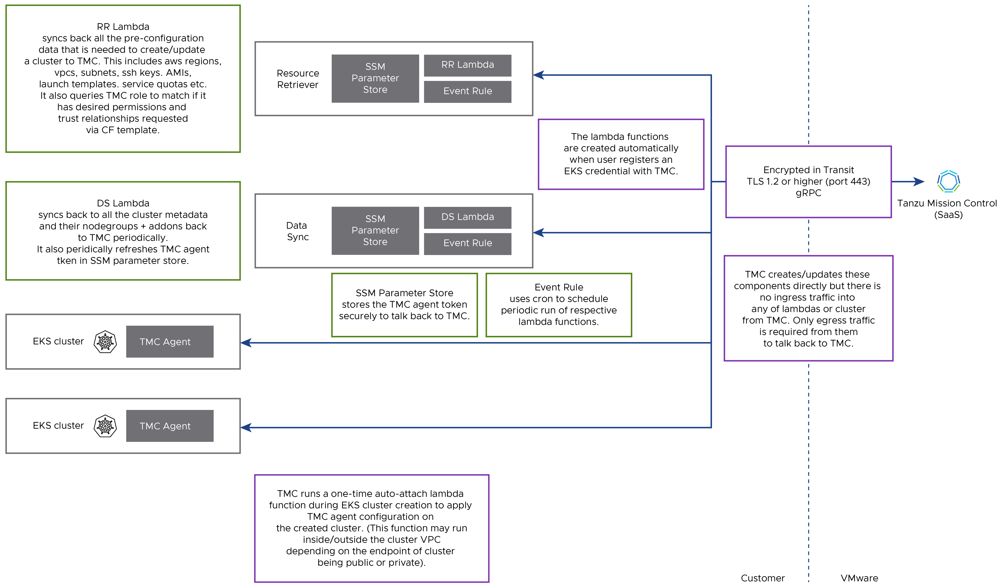

# VMware Tanzu Mission Control,Tanzu Application Platform and Tanzu Service Mesh Reference Design

VMware Tanzu Services like Tanzu Mission Control,Tanzu Application Platform and Tanzu Service Mesh combined Reference Design simplifies operation of multi-cloud deployment by centralizing management and governance for clusters and teams across on-premises, public clouds. 

Tanzu Mission Control is a centralized management platform for consistently operating and securing your Kubernetes infrastructure and modern applications across multiple teams and clouds.

Tanzu Service Mesh provides advanced, end-to-end connectivity, security, and insights for modern applications across application end-users, microservices, APIs, and data enabling compliance with Service Level Objectives (SLOs) , data protection and privacy regulations.

VMware Tanzu Application Platform is a single, end-to-end integrated platform solution that enables companies to build and deploy more software, more quickly and securely, through a rich set of developer tooling and a pre-paved path to production.

This reference design presents a blueprint for managing the life cycle of Amazon EKS clusters using Tanzu Mission Control. It also covers the integrated platform setup using Tanzu Application Platform and the securing of K8 clusters with Tanzu Service Mesh to enhance their capabilities.

## Amazon Networking and Virtual Private Cloud(VPC)
For Tanzu services like Tanzu Mission Control-SaaS(TMC),Tanzu Application Platform(TAP),Tanzu Service Mesh-SaaS(TSM) etc on Amazon EKS you can refer the [Amazon Networking and Virtual Private Cloud(VPC) design recommendations](aws-netwoking.md).

## Tanzu Mission Control 

Tanzu Mission Control allows you to manage your global portfolio of Kubernetes clusters.You can do the following with Tanzu Mission Control:

* **Centralized lifecycle management** : Managing the creation,deletion,update,upgrade and scale of amazon EKS clusters from Tanzu Mission Control user interface.
* **Existing EKS cluster lifecycle management** :- Add and manage existing EKS cluster lifecycle including policy enforcement ,data protection , authorization etc.
* **Centralized management** : View the inventory of clusters and the health of clusters and their components.
* **Authorization** : Centralized authentication and authorization with federated identity from multiple sources (e.g., AD, LDAP, and SAML), plus an easy-to-use policy engine for granting the right access to the right users across teams.
* **Compliance** : Enforcing all kubernetes clusters to apply the same set of various policies like access policy,image registry policy,network policy , quota policy,security policy,custom policy etc. 
Tanzu Mission Control support resource hierarchy at following 3 levels
  - Organization
  - Object groups (cluster groups and workspaces)
  - Kubernetes objects (clusters and namespaces)

* **Data protection** : Managing Velero deployment, configuration, and schedule to ensure that cluster manifests and persistent volumes are backed up & restorable.
* **Local Image Registry Support** : Tanzu Mission Control supports pulling its agent and extension images from a private, local OCI registry instead of from the Tanzu Mission Control SaaS registry.
Support for local image registry lets you:
  - Use your own local/private OCI image registry.
  - Configure Tanzu Mission Control to deploy its agents and extensions from your private registry.
  - Run security and vulnerability scans on Tanzu Mission Control cluster components before deploying to your production clusters.

### Amazon EKS Life Cycle Management
You can provision a new EKS cluster or add an existing EKS cluster on Tanzu Mission Control and manage the cluster life cycle operations like upgrade,scale,delete etc. 

Following diagram describe the Tanzu Mission Control Amazon EKS lifecyle management architecture.

Consider the following design implications for managing your Amazon EKS clusters from Tanzu Mission Control

 **Decision ID** | **Design Decision**  | **Design Justification**  | **Design Implications**
-----|-----|-----|-----
 TMC-EKS-001 | Create all new EKS clusters from Tanzu Mission Control | It gives centralized lifecycle management console for EKS clusters creation ,deletion,upgrade,scale,health,data protection , compliance etc. | Without a centralized  management LCM tools like Tanzu Mission Control increases operation team overhead and cost. 
 TMC-EKS-002 | Integrate all EKS clusters new or existing with Tanzu Mission Control | You can better control all EKS life cycle management and enforce organization's security policies across all the clusters. | Without a centralized  management LCM tools like Tanzu Mission Control , policy management is difficult to maintain. 

 For more details , Please refer to the [Managing the Lifecycle of Amazon EKS Clusters on Tanzu Mission Control](https://docs.vmware.com/en/VMware-Tanzu-Mission-Control/services/tanzumc-using/GUID-98D0A4F8-508A-4D75-94E2-C1A646276F16.html) .