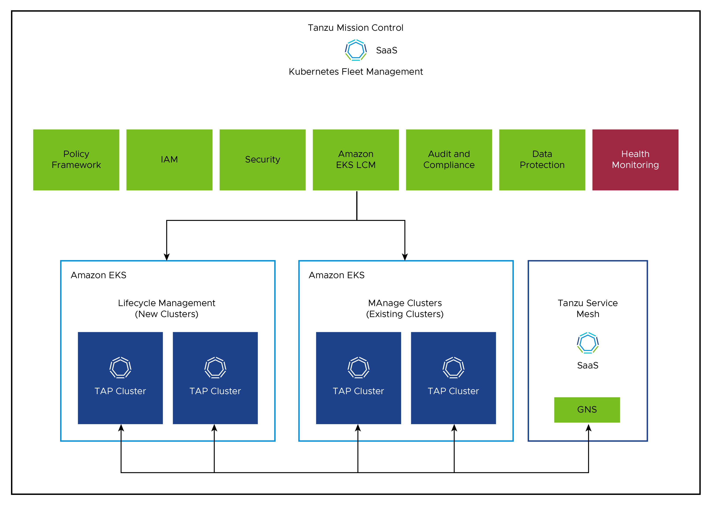

# VMware Tanzu Mission Control,Tanzu Application Platform and Tanzu Service Mesh Reference Design

VMware Tanzu Services like Tanzu Mission Control,Tanzu Application Platform and Tanzu Service Mesh combined Reference Design simplifies operation of multi-cloud deployment by centralizing management and governance for clusters and teams across on-premises, public clouds. 

Tanzu Mission Control is a centralized management platform for consistently operating and securing your Kubernetes infrastructure and modern applications across multiple teams and clouds.

Tanzu Service Mesh provides advanced, end-to-end connectivity, security, and insights for modern applications across application end-users, microservices, APIs, and data enabling compliance with Service Level Objectives (SLOs) , data protection and privacy regulations.

VMware Tanzu Application Platform is a single, end-to-end integrated platform solution that enables companies to build and deploy more software, more quickly and securely, through a rich set of developer tooling and a pre-paved path to production.

This reference design presents a blueprint for managing the life cycle of Amazon EKS clusters using Tanzu Mission Control. It also covers the integrated platform setup using Tanzu Application Platform and the securing of K8 clusters with Tanzu Service Mesh to enhance their capabilities.

## Tanzu Mission Control Amazon EKS Life Cycle Management

Tanzu Mission Control provides features to manage Amazon EKS lifecycle management. 

### Amazon Networking and Virtual Private Cloud(VPC)
For Tanzu services like Tanzu Mission Control-SaaS(TMC),Tanzu Application Platform(TAP),Tanzu Service Mesh-SaaS(TSM) etc on Amazon EKS you can refer the [Amazon Networking and Virtual Private Cloud(VPC) design recommendations](aws-netwoking.md).
